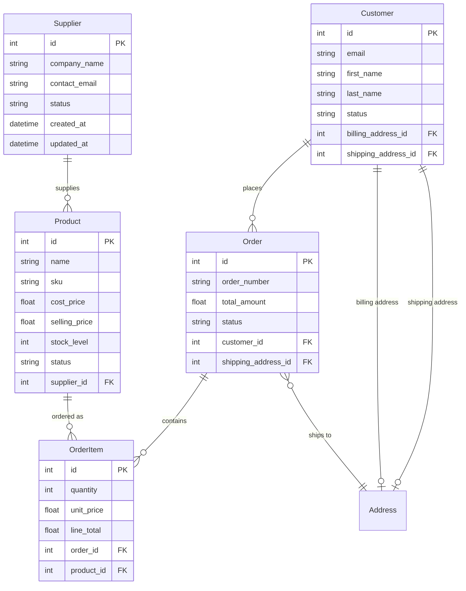

# Design Document

## Overview

This design establishes the core entity architecture for a Symfony-based dropshipping platform. The system will use Doctrine ORM to manage five primary entities: Supplier, Product, Customer, Order, and AdminUser, along with supporting entities like OrderItem and Address. The design follows Symfony best practices and implements proper entity relationships, validation, and serialization.

## Architecture

### Entity Structure

The system follows a layered architecture with:
- **Entity Layer**: Doctrine entities with proper annotations and relationships
- **Repository Layer**: Custom repository classes for complex queries
- **Validation Layer**: Symfony validation constraints
- **Serialization Layer**: Symfony Serializer groups for API responses

### Database Design

The entities will be mapped to the following database tables:
- `suppliers` - Supplier information and contact details
- `products` - Product catalog with pricing and inventory
- `customers` - Customer profiles and contact information
- `orders` - Order headers with totals and status
- `order_items` - Individual line items within orders
- `admin_users` - Administrative user accounts
- `addresses` - Reusable address entities for customers and orders

## Components and Interfaces

### Core Entities

#### Supplier Entity
```php
class Supplier
{
    private int $id;
    private string $companyName;
    private string $contactEmail;
    private ?string $contactPerson;
    private ?string $phone;
    private ?string $address;
    private ?string $notes;
    private string $status; // active, inactive
    private \DateTimeInterface $createdAt;
    private \DateTimeInterface $updatedAt;
    
    // Relationships
    private Collection $products; // OneToMany
}
```

#### Product Entity
```php
class Product
{
    private int $id;
    private string $name;
    private string $sku;
    private string $supplierReference;
    private ?string $description;
    private array $images; // JSON array
    private float $costPrice;
    private float $sellingPrice;
    private ?float $weight;
    private ?array $dimensions; // JSON: width, height, depth
    private ?string $category;
    private int $stockLevel;
    private string $status; // available, out_of_stock, discontinued
    private \DateTimeInterface $createdAt;
    private \DateTimeInterface $updatedAt;
    
    // Relationships
    private Supplier $supplier; // ManyToOne
    private Collection $orderItems; // OneToMany
}
```

#### Customer Entity
```php
class Customer
{
    private int $id;
    private string $email;
    private string $firstName;
    private string $lastName;
    private ?string $phone;
    private ?Address $billingAddress; // OneToOne
    private ?Address $shippingAddress; // OneToOne
    private string $status; // active, inactive, blocked
    private \DateTimeInterface $createdAt;
    private \DateTimeInterface $updatedAt;
    
    // Relationships
    private Collection $orders; // OneToMany
}
```

#### Order Entity
```php
class Order
{
    private int $id;
    private string $orderNumber; // Generated unique identifier
    private float $subtotal;
    private float $taxAmount;
    private float $shippingAmount;
    private float $totalAmount;
    private string $status; // pending, processing, shipped, delivered, cancelled
    private Address $shippingAddress; // ManyToOne
    private ?\DateTimeInterface $shippedAt;
    private ?\DateTimeInterface $deliveredAt;
    private \DateTimeInterface $createdAt;
    private \DateTimeInterface $updatedAt;
    
    // Relationships
    private Customer $customer; // ManyToOne
    private Collection $orderItems; // OneToMany
}
```

#### OrderItem Entity
```php
class OrderItem
{
    private int $id;
    private int $quantity;
    private float $unitPrice;
    private float $lineTotal;
    
    // Relationships
    private Order $order; // ManyToOne
    private Product $product; // ManyToOne
}
```

#### AdminUser Entity
```php
class AdminUser implements UserInterface
{
    private int $id;
    private string $email;
    private string $password; // Hashed
    private string $firstName;
    private string $lastName;
    private array $roles; // JSON array: ROLE_ADMIN, ROLE_MANAGER, ROLE_OPERATOR
    private string $status; // active, inactive
    private ?\DateTimeInterface $lastLoginAt;
    private \DateTimeInterface $createdAt;
    private \DateTimeInterface $updatedAt;
}
```

#### Address Entity
```php
class Address
{
    private int $id;
    private string $firstName;
    private string $lastName;
    private string $company;
    private string $addressLine1;
    private ?string $addressLine2;
    private string $city;
    private string $state;
    private string $postalCode;
    private string $country;
    private ?string $phone;
}
```

### Repository Classes

Each entity will have a corresponding repository class extending Doctrine's ServiceEntityRepository:

- `SupplierRepository` - Methods for finding active suppliers, searching by name
- `ProductRepository` - Methods for filtering by supplier, category, availability
- `CustomerRepository` - Methods for searching by email/name, filtering by status
- `OrderRepository` - Methods for filtering by status, date ranges, customer
- `AdminUserRepository` - Methods for authentication, role-based queries

## Data Models

### Entity Relationships



### Validation Rules

- **Email fields**: Valid email format, unique where required
- **Required strings**: Not blank, appropriate length limits
- **Prices**: Positive decimal values with 2 decimal places
- **Status fields**: Choice constraints with predefined values
- **SKU**: Unique across products
- **Order numbers**: Auto-generated, unique format

### Serialization Groups

API serialization groups for different contexts:
- `list` - Basic fields for listing views
- `detail` - Complete entity data for detail views
- `create` - Fields required for entity creation
- `update` - Fields allowed for updates

## Error Handling

### Validation Errors
- Use Symfony's validation component with proper error messages
- Return structured validation errors for API responses
- Handle unique constraint violations gracefully

### Database Errors
- Implement proper exception handling for database operations
- Use transactions for multi-entity operations (orders with items)
- Handle foreign key constraint violations

### Business Logic Errors
- Validate stock availability before creating order items
- Ensure order totals are calculated correctly
- Prevent deletion of entities with dependent records

## Testing Strategy

### Unit Tests
- Entity validation and business logic
- Repository method functionality
- Relationship integrity

### Integration Tests
- Database operations and migrations
- Entity lifecycle events
- Complex queries and joins

### Functional Tests
- API endpoints for CRUD operations
- Authentication and authorization
- Data serialization and deserialization

The design ensures a robust, scalable foundation for the dropshipping platform while following Symfony and Doctrine best practices.